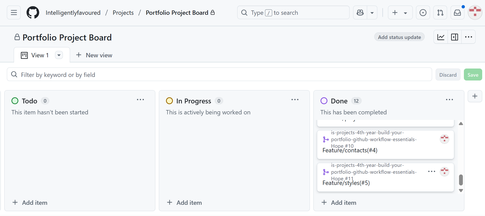
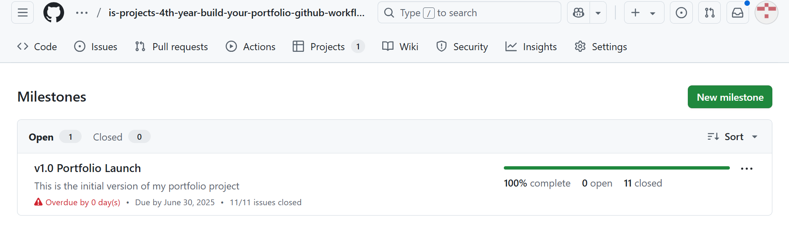
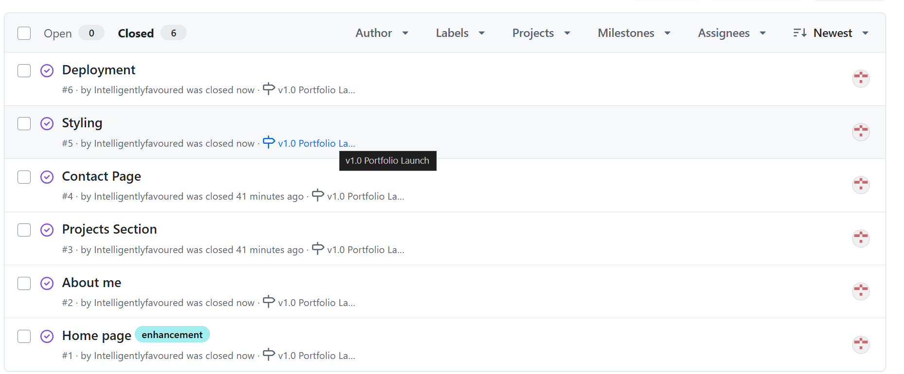
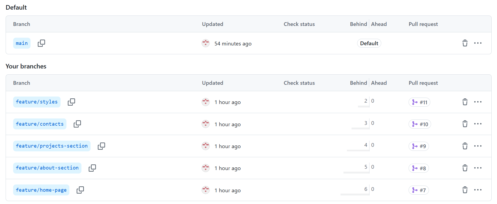
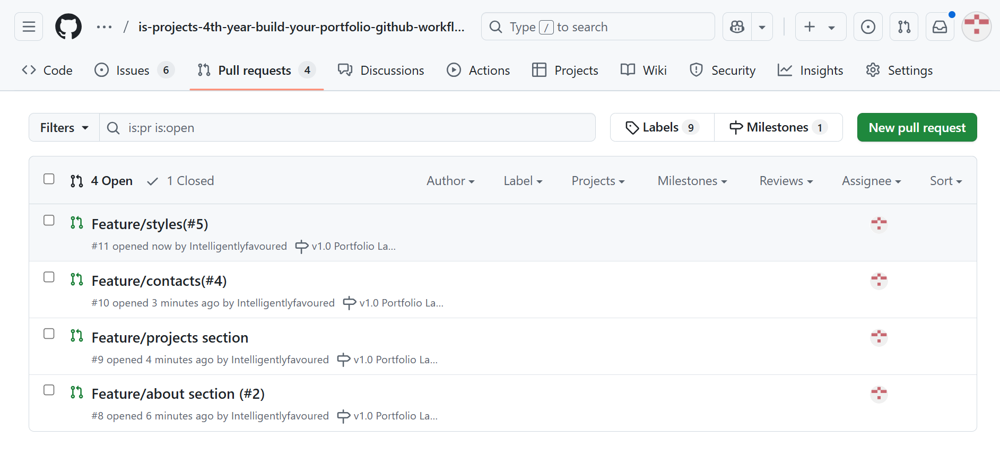
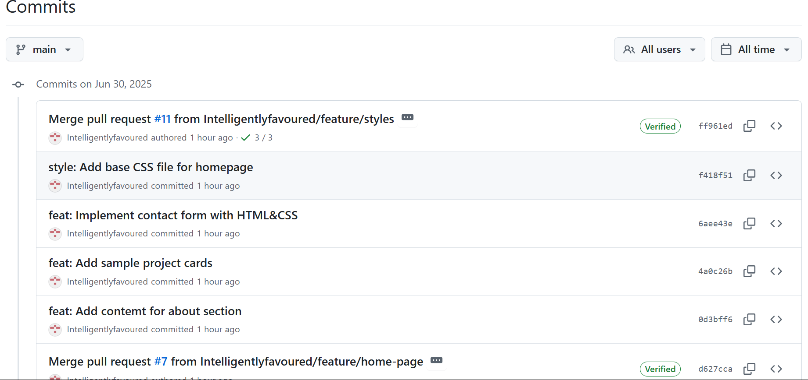
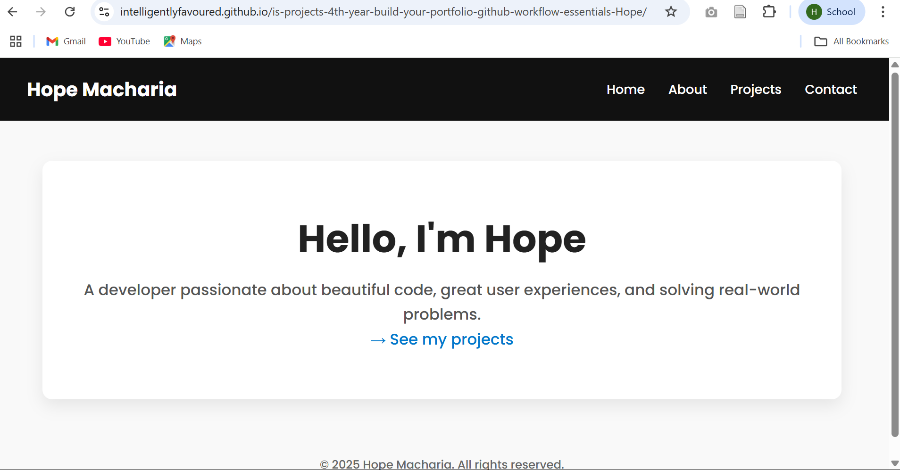

# Personal Portfolio Documentation

## 1. Student Details

- **Full Name**: Hope Macharia  
- **Admission Number**: 150326
- **GitHub Username**: IntelligentlyFavoured  
- **Email**: hope.macharia@example.com  

## 2. Deployed Portfolio Link

- **GitHub Pages URL**:  
https://intelligentlyfavoured.github.io/is-projects-4th-year-build-your-portfolio-github-workflow-essentials-Hope/

## 3. Learnings from the Git Crash Program

### What I Thought I'd Learn vs What I Actually Learned

#### 1. Concept: Branching

**Expectation 👀**: I assumed branching was overkill for a solo project—just something large teams use to avoid stepping on each other’s toes.
**Reality 😅**: Branching became my safety net! It allowed me to experiment confidently without messing up the main site.
**Impact 💡**: I used branches like `feature/home-page` and `feature/about-section` to organize work and merge only when I was sure everything looked right.

---

#### 2. Concept: Commit Messages & Issue References

**Expectation 👀**: I thought commit messages were just a formality—and referencing issues? Probably not needed for a small assignment.
**Reality 😅**: Writing clear, purposeful messages and linking them to issues (e.g., `feat: add intro (#1)`) made my history super readable and auto-closed issues like magic!
**Impact 💡**: I now see commit messages as part of the documentation. They helped me explain changes, track progress, and stay accountable.

---

#### 3. Concept: Pull Requests

**Expectation 👀**: I figured pull requests (PRs) were only useful when collaborating with others.
**Reality 😅**: PRs helped me pause and review my own work before merging. They also created a nice record of progress and made it easier to share feedback with my instructor.
**Impact 💡**: Using PRs gave me confidence that every piece of code was reviewed—even if just by me—and prevented sloppy mistakes from creeping in.

---

#### 4. Concept: Milestones & GitHub Issues

**Expectation 👀**: I thought issues and milestones were more for managing big teams or corporate sprints.
**Reality 😅**: Surprisingly, breaking down my tasks into issues and grouping them under the `v1.0 Portfolio Launch` milestone kept me focused and organized.
**Impact 💡**: My project stayed on track with clear deliverables. The June 30, 2025 deadline didn’t sneak up on me thanks to that roadmap.

---

## 4. Screenshots of Key GitHub Features

### A. Project Board

  
*Caption: GitHub Project Board used to track development tasks and progress.*

### B. Milestones and Issues

  
*Caption: Milestone created to group tasks for version 1.0 release.*

  
*Caption: Issues created and tracked as part of milestone v1.0.*

### C. Branches

  
*Caption: Multiple branches used to manage separate features.*

### D. Pull requests

  
*Caption: Pull request opened to merge `feature/about-section` into `main`.*

### E. Commit history

  
*Caption: Clear, semantic commit messages tied to issue numbers.*

### F. Live Website Preview

  
*Caption: Live homepage layout as deployed via GitHub Pages.*

